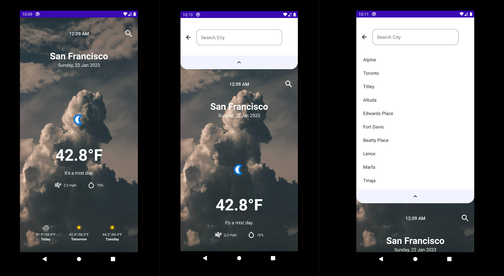

# Project Overview
A one screen weather app, with a 3 days weather forecast built with the free weather [API](https://www.weatherapi.com)

## Requiremnts
- Android Studio.
- Java JDK.
- Android SDK.
- Weather API Key.

## How to build

1. First clone the repo on any location of your choice on your laptop, you can execute the following command to clone it ` git clone https://github.com/RofaeilAshaiaa/SimpleWeatherApp` in the _terminal/command_ line on Linux/Mac or in your _bash shell/git bash_ on Windows.

2. You'll need an API key from the free weather [API](https://www.weatherapi.com) to be able to build and run the app. So, if you don't have an API key, go to the website and signup to get an API key.

3. Assuming you have an API, open the project in the file manager of your operating system and navigate to `values` folder (which you will find by navigating through SimpleWeatherApp -> app->src->main->res->values). You'll need to create a resource files with your API key. Create a new file called `secrets.xml` and paste the following content and replace the value of `weather_api_key` with your API key:
    ```
    <?xml version="1.0" encoding="utf-8"?>
    <resources>
       <string name="weather_api_key">put_your_api_key_here</string>
    </resources>
    ```
4. Finally, Open Android Studio and import the project you have cloned then you can let android studio pull the required dependencies and wait until the build finishes then you can deploy the app to an emulator or any connected device. 


## Missing Functionality [To-Do]

- When the user search for a city and click on one, we need to reload the ui with the selected city and update the UI accordingly.
- The Search view needs to be moved over the main home screen UI instead of pushing the content down and appear in top of it.
- Adding unit tests and UI tests.

## Known Issues
- Some times the search field is cleared without clicking the clear icon due to a bug in current search implementation.
